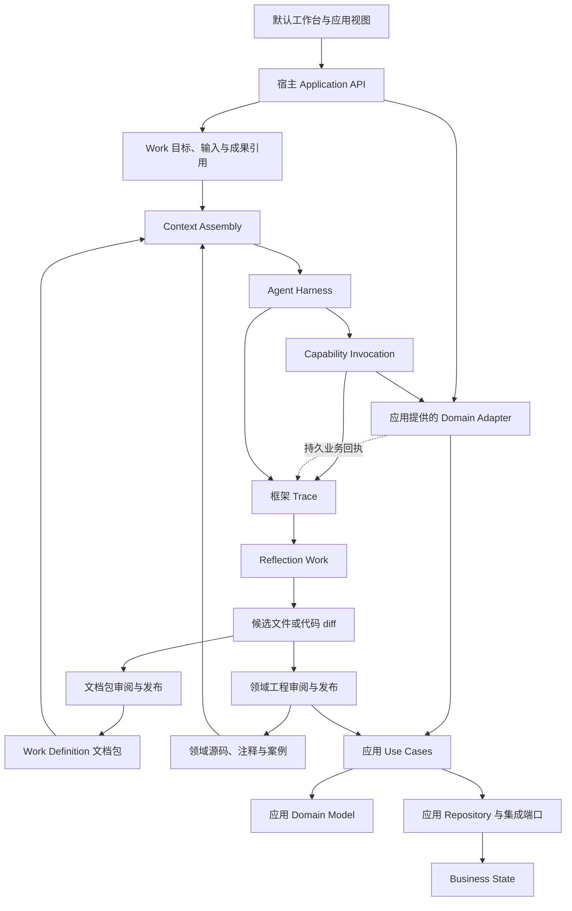

# Airic Framework 独立项目技术设计

版本：0.3 · 日期：2026-09-09 · 状态：首版实现基线（实施进度见 `development-plan.md`）

本文完整描述 Airic Framework 的职责、公共协议、运行机制、项目结构和演进方式，可移入独立框架仓库使用。接口与目录均为提案；包名暂定。本文不声明现有原型已实现这些合同，不包含某个行业应用的领域设计。

本版将交付形态确定为“运行内核 + 文件存储 + 默认工作台 + 项目脚手架 + 开发 skill”，并把框架运行模型收缩为 Work 与跨 Domain 边界的 Action。ContextEnvelope 和 trace 负责统一运行与归因，session、内部步骤、交互确认和压缩仍归 harness。框架自身不依赖数据库，首版以单主机、单写入进程为约束。CLI、UI 和 skill 均是待实现的正式交付物，不是已经可用的功能。

## 1. 定位与核心决策

Airic Framework 把领域代码与文档定义的工作连接起来，使 Agent 能按照组织的 Operating Model，自主组织工作并通过确定性业务系统完成目标。

两端协议如下：

1. **Domain Model + Use Cases** 是 Domain Capability 的语义协议。普通代码、类型、注释和案例共同表达业务概念、合法操作、前提与效果。架构师审阅它们，Agent 阅读它们，运行系统执行它们。
2. **Work Definition 文档包** 是 Operating Model 的装配协议。Markdown 定义角色、Process、Procedure、precedent、沟通与反射方法，Agent 在实际情境中理解和执行。

框架负责将这两端绑定到一次具体 Work：按统一规则装配并标注上下文、通过 harness 运行 Agent、交付领域调用、保存可归因的 trace，并将反馈转化为文档或领域代码的改进建议。

面向开发者，它是一个带默认运行体验的应用框架：创建项目、启动工作台、配置模型后即可与 Agent 对话并办理示例业务，再逐步替换成自己的领域。开发 skill 是人和编程 Agent 共用的任务式文档入口，指导应用建设，不替代上述两端业务协议。

首版采用以下决策：

| 事项 | 决策 |
| --- | --- |
| 项目边界 | 独立源码仓库、独立测试与版本发布；应用通过公开包使用框架 |
| 运行方式 | TypeScript 运行内核，由生成的应用服务装配；内置工作台通过 API 接入 |
| 默认环境 | Node.js 24、单主机、本地文件存储、一个持有写入锁的 runtime；框架不要求数据库 |
| Agent Harness | 首个适配器采用 Pi；框架公共类型不暴露 Pi 类型 |
| 业务编排 | Agent 按 Markdown Process 决定下一步，框架不编译业务运行图 |
| 领域接入 | 应用注册公开 Use Cases，并提供对应版本的领域源码与阅读入口 |
| 业务存储 | 由应用领域拥有；框架存储不容纳通用化的业务实体表 |
| 改进闭环 | Reflection 产出 Operating Model、Domain Model 或关联变更的候选文件/diff；不建立提案状态机 |
| 用户界面 | 首版自带可运行的工作台：对话、派生运行状态、成果、harness 交互与改进；允许应用扩展 |
| 项目创建 | 脚手架生成应用、示例领域、工作定义、UI 装配与测试，创建后即可启动 |
| 开发文档 | 随版本交付开发 skill 与引用文档，供人及其他编程 Agent 使用 |

独立仓库能约束依赖与发布边界，但会增加版本兼容和联调成本。首版让应用消费框架包、默认 UI 和模板，不要求另行部署框架平台。内核保持可脱离 UI 使用，完整产品则必须包含 UI，不能将其留作应用开发者的前置工作。

## 2. 目标与边界

### 2.1 目标

- 应用保留独立、可测试的领域模型与 Use Cases；接入或移除框架不改变其业务语义。
- 同一领域支持多份 Work Definition；一份工作定义可组合多个领域的公开能力。
- Agent 根据目标、方法文档和当前业务状态自主选择信息获取与操作路径。
- 重启和失败不会丢失 Work、已提交业务效果的关联及用于归因的证据；会话内等待和恢复能力由 harness 声明。
- 人和 Agent 能定位规则源码、实际使用的方法版本、业务结果和改进依据。
- 框架可以在没有任何生产应用源码的环境中独立构建、测试和发布。
- 新用户不先写页面或部署数据库，就能启动工作台；配置模型后完成首次真实 Agent 交互。
- 编程 Agent 通过随版本交付的开发 skill，在公开边界内创建和扩展应用。

### 2.2 首版范围

实现一个完整的工作执行与改进闭环，以及能直接使用它的脚手架和工作台；面向单组织、单主机，不先建设分布式平台、通用流程设计器、领域代码生成器或业务 DSL。

领域实体、行业规则、专用业务视图、行业文档渲染、外部系统适配及业务存储迁移属于应用。框架提供通用对话与工作 UI、成果展示扩展点及默认文件视图，不解释行业含义。应用可以使用文件或数据库；框架自身不使用数据库不等于禁止应用使用数据库。

本文中的“确定性”指代码明确规定操作语义并检查可执行约束。领域代码无法自动证明原始证据真实、人的专业裁定正确，或任何模型判断都正确。

## 3. 总体结构与依赖方向



上图表示运行关系。代码依赖方向另行规定：

```text
应用 composition root
  ├─ Framework public API / adapters
  └─ 应用 Domain Adapter
       ├─ Framework integration contracts
       └─ 应用 Application Use Cases
            └─ 应用 Domain Model

框架 adapters → 框架 application → 框架 domain
应用 adapters → 应用 ports / domain
```

约束：

- 应用的 Domain 与 Use Cases 不导入框架、模型 SDK、工具协议或 UI 类型。框架专有上下文在应用 Domain Adapter 中转换为应用自己的身份、命令与追踪信息。
- 框架核心不导入应用包，不出现应用实体名称、表名、角色枚举和业务状态枚举。
- Domain Adapter 属于应用，负责将公开 Use Cases 接入框架；不在 adapter 中补写遗漏的业务不变量。
- UI、Agent、批处理通过相同的应用 Use Cases 改变业务状态；非 Agent 调用无需伪造 Work、session 或 Execution。
- 框架只为 Work 与跨领域边界的 Action 建立运行模型；其余 Agent 过程以 trace 表达。

## 4. 状态所有权

| 状态 | Owner | 框架如何使用 |
| --- | --- | --- |
| 行业业务实体与业务 revision | 应用领域 | VersionedRef、授权查询、命令回执 |
| 领域源码、注释、测试及软件 release | 应用工程项目 | 绑定 release 的只读源码包 |
| Work Definition 已发布文件包 | 框架定义管理用例，通过存储端口保存 | 不可变 revision、manifest、文件引用 |
| Work | 框架 | 持久目标、定义绑定、成果引用和总体结束状态 |
| Action 请求及投递观察 | 框架调用领域 | 关联领域回执，恢复未完成调用 |
| 已提交命令的权威业务回执与业务审计 | 应用领域 | 通过接入端口查询或导入，不另造独立业务真相 |
| Agent 消息、问题、回答、内部步骤和工具确认 | Harness | 通过规范化事件进入 Work trace；框架不重建内部对象 |
| 对行业动作的最终批准有效性 | 应用领域及其认可的授权机制 | 作为领域对象或可信调用材料，由用例在提交时验证 |
| ContextEnvelope 与 Canonical Trace | 框架 | 记录实际上下文来源、运行事实及业务回执引用 |
| Harness session、checkpoint、缓存与压缩摘要 | Harness adapter | 自行持久化；影响推理时向 trace 报告来源和 digest |
| Reflection 候选及采用结果 | 目标文档/代码项目 | 框架 trace 关联候选 revision 与实际生效 release |

框架状态保存到项目的数据目录，结构化记录、对话、版本化文档和附件都以文件持久化。应用独立拥有业务存储，即使同样选择文件，也有自己的命名空间与提交合同。领域 Artifact 仍由应用保存，框架仅关联其引用，不要求复制应用已有文件。文件目录布局与一致性约定见第 12 节。

## 5. Domain 接入协议

### 5.1 语义来源与接入封装

Domain Model + Use Cases 构成完整业务语义。框架需要一个薄接入封装来发现、阅读和调用它们：

- **Domain Release**：领域标识、release、构建标识、只读源码包及公开能力索引。
- **Source Access**：定位 bounded context 说明、相关领域符号、用例源码、注释和测试案例。
- **Capability Binding**：用例 ID、种类、输入输出边界、源码位置与调用实现。
- **Command Receipt Access**：对产生业务效果的命令提供稳定身份、幂等及结果查询。

这一边界也是业务评审的主要入口：不只描述类型和方法签名，还应明确操作前提、业务效果、失败含义及必要的授权条件。基础设施负责实现端口合同，通过单元、合同和集成测试验证；测试不能弥补内层合同遗漏的业务语义。

接入元数据不重新描述领域不变量。方法索引、工具说明和 schema 应尽量由已有用例定义派生；必须手写的映射与实现同版本发布，并通过合同测试验证。运行时 schema 校验仍然必需，静态类型不能验证外部输入。

首版由应用显式注册能力，不扫描任意 public 方法并自动开放，也不尝试从源码完整推断权限和约束。

### 5.2 基础引用

```ts
type ObjectRef = {
  system: string;
  type: string;
  id: string;
};

type VersionedRef = {
  object: ObjectRef;
  revision: string;
};

type SourceLocator = {
  bundle: VersionedRef;
  path: string;
  symbol?: string;
};
```

ObjectRef 是寻址信息，不是授权凭据。输入中出现 scope、actor 或对象 ID，不能据此建立可信身份。框架首版接收宿主建立的主体与作用域，资源取回及执行时再次检查访问权。

### 5.3 能力与调用

区分 Query、纯计算和 Command。具有外部效果的操作是带相应效果语义的 Command。工具返回自然语言、结构化输出或 Agent 声称完成，都不能单独充当业务提交回执。

```ts
// 概念接口：RuntimeSchema、TrustedCallContext 由正式协议定义。
interface CapabilityBinding {
  id: string;
  kind: "query" | "compute" | "command";
  source: SourceLocator;
  inputSchema: RuntimeSchema;
  outputSchema: RuntimeSchema;
  invoke(context: TrustedCallContext, input: unknown): Promise<unknown>;
}

interface DomainModule {
  id: string;
  release: string;
  buildId: string;
  sourceBundle: VersionedRef;
  readme: SourceLocator;
  capabilities: readonly CapabilityBinding[];
  inspectCommand?(context: TrustedCallContext, commandId: string): Promise<CommandInspection>;
}
```

上述 `unknown` 表示传输边界，正式实现须在进入和离开边界时解析，并提供类型推导。Query-only module 可省略命令检查能力；注册 Command 时必须说明持久回执及对账能力。无法提供可靠结果查询的外部集成可以接入，但失败不确定时只能阻塞并寻求对账，不能获得自动安全重试的保证。

TrustedCallContext 由宿主创建，至少关联认证主体、Work 范围、Action/命令 ID、目标 revision、应用认可的业务授权材料和预期 Domain release。调用参数中的同名字段不覆盖该上下文。harness session、turn 或内部 Execution ID 可以作为 trace correlation，但不是领域调用建立信任的依据。

拒绝结果保留领域错误码、解释与对象引用，例如 `RevisionConflict`、`RequiredEvidenceMissing`。框架不按错误码自动决定业务下一步，由 Agent 按文档选择补充信息、更正、等待或提出修改建议。

### 5.4 源码作为可阅读协议

应用构建时提供受授权的源码包，包含领域代码、Use Cases、必要类型、注释和代表性测试，不包含密钥、真实客户数据或与理解业务无关的基础设施。

框架首先提供 context 导航与能力目录，再按当前 Work 和 Agent 查询加载相关代码。源码路径和 symbol 可寻址，返回片段包含所属 release、摘要及周边定义，支持继续取回完整内容。

源码本身是语义来源，生成说明仅作为阅读辅助。注释解释业务依据和理由；如注释与执行代码不一致，记录发现并请求澄清或提出修订，不将注释解释为绕过实际约束的许可。

源码摘要只能证明读取了哪个文件，不能独自证明运行的二进制就是该源码。应用构建、发布注册及合同测试负责建立 source bundle 与 buildId 的对应关系。

### 5.5 版本对应

每次 ContextEnvelope 固定实际绑定的 Domain release、buildId 和源码包摘要。调用边界检查实际实现仍匹配该绑定。

若宿主替换实现，使用旧 envelope 的新命令在不匹配时返回 `BindingChanged`。框架检查定义包兼容范围，重新绑定并装配新源码；Agent 根据新的 envelope 与当前业务状态继续。也可由宿主保留旧实现服务在途工作，但须显式路由到原 release。

不能仅保留旧源码、同时调用新实现。恢复旧 Action 的回执时使用它原本的领域命令身份与版本，避免把恢复当作新业务请求。

## 6. Work Definition 协议

### 6.1 文件包

工作定义是一套可版本化文件，`work.yml` 是入口。目录用于组织阅读，语义身份和加载方式由 manifest 明确声明。

```text
work-definition/
  work.yml
  README.md
  instructions.md
  processes/main.md
  procedures/collect-information.md
  procedures/resolve-exceptions.md
  precedents/
  reflection/review-work.md
  schemas/input.schema.json
  examples/
  resources/
```

ProcessDefinition、Procedure、Role 和 Reflection Method 是文档角色；不必分别拥有一套数据库聚合或解释器。工作定义是整包 Artifact，正式发布固定内容与依赖，候选可继续编辑。

### 6.2 Manifest 示例

```yaml
apiVersion: airic.work/v1alpha1
kind: WorkDefinition
id: case-assistance
name: 事务协助
readme: README.md
inputs:
  schema: schemas/input.schema.json
documents:
  - id: instructions
    path: instructions.md
    role: instructions
    load: required
  - id: main
    path: processes/main.md
    role: process
    load: required
  - id: exceptions
    path: procedures/resolve-exceptions.md
    role: procedure
    load: on-demand
domains:
  - id: case-domain
    compatibleReleases: ">=1.0.0 <2.0.0"
capabilities:
  required: [case.read, case.update, case.check-outcome]
completion:
  checks: [case.check-outcome]
  acceptance: human
```

此例中的领域 ID 为合成示例，不是框架内建能力。manifest 的领域 release 使用应用声明的版本范围；Work 创建时解析成精确版本。引用的能力与检查必须真实存在且合同兼容，示例中的完成检查也应属于相应领域的公开能力。

能力声明表达需求，不授予权限。运行时可用能力受宿主委托范围、当前主体权限和工作范围共同限制；缺少必需能力时明确报告接入或授权不足。领域用例在提交时仍检查实际权限，不能把启动时的能力列表视为持续有效的授权。

Manifest 只定义识别、依赖、装配和接受要求；Markdown 正文描述工作路径。文档中的步骤、分支和嵌套关系不编译成运行图。

Package input schema 定义一次 Work 接受的启动信息，不重定义领域实体结构；可引用已发布的领域 schema。业务校验仍在 Use Case 中执行。

### 6.3 加载与发布

必需文档进入每次新装配的上下文；按需文档提供目录和寻址入口。被加载的文档版本、路径和原因写入该轮 ContextEnvelope 及 `context.assembled` trace。README、样例和原始附件不会因扩展名或所在目录自动成为指令。

依赖包在发布时固定 revision。新建文件仅在被声明或显式作为参考加载后参与执行。解析结果是源文件的派生视图，不另存可独立修改的定义副本。

发布检查包括 manifest/schema、引用完整性、路径安全、依赖和能力兼容、必需资源及选择的案例验证。包内路径必须落在包根目录内，防止解包路径穿越或符号链接逃逸。包不能加载任意宿主代码。

保存候选、验证、批准和发布是不同事实。发布绑定精确候选及检查结果。无效草稿可以保存继续编辑，但不能作为有效定义启动正式 Work。试运行绑定明确候选与隔离领域实例。

## 7. 最小框架模型

框架长期关心两个运行概念：

| 概念 | 独立不变量 |
| --- | --- |
| Work | 一次面向用户的工作，固定目标、输入、Work Definition revision、Domain binding、成果引用及总体结束状态 |
| Action | 一次跨越 Domain Capability 边界的命令意图，固定命令身份、输入摘要、目标 revision、调用身份与领域回执；可有多次传输和对账观察 |

Work Definition、DomainModule 是版本化协议。`ContextEnvelope` 和 `TraceEvent` 是不可变的运行记录/值，不是拥有独立生命周期的 Entity。Reflection 产生的候选文件或代码 diff 由其目标项目管理。

以下词汇可以出现在 Work Definition、Agent 消息、harness 事件或 UI 中，但框架不建立对应 Repository、聚合或状态机：ProcessRun、WorkItem、Execution、DecisionRequest、Decision、Approval、Plan、Delegation、Checkpoint、Summary。即使 harness 为恢复而持久保存这些概念，它们仍属于该 harness 的实现。

判断标准不是“是否需要记录”，而是“框架是否拥有一条必须独立执行的不变量”。问题与答复需要进入 trace，工具确认可能需要在重启后恢复，压缩摘要也会影响后续行为；这些要求只形成 harness 端口与 trace 合同，不自动产生框架领域对象。

## 8. 统一运行逻辑

### 8.1 一次工作如何运行

1. 宿主提交可信主体、目标、Work Definition revision、输入、对象引用和可委托范围；框架创建或打开 Work。
2. 每次 Agent 开始推理前，runtime 调用统一 Context Assembly，生成本轮不可变的 `ContextEnvelope` 并写入 `context.assembled` trace。
3. harness 接收 envelope、受控 Domain Capability gateway 和 trace sink，使用自己的 session、turn、内部任务、压缩、等待和恢复机制运行 Agent。
4. Agent 可以阅读方法与领域代码、查询业务状态、与用户交流并调整工作路径。只有发起领域 Command 时才创建 Action，并经过第 9 节的提交协议。
5. harness 将消息、工具、内部交互和结果以规范化 trace 事件或带 provider 标识的原始附件交回；框架不据此重建它的内部对象。
6. Agent 或用户提交工作成果；定义中声明的确定性完成检查在实际绑定版本上执行，Work 随结果保持打开、完成或取消。

runtime 统一“何时装配上下文、如何开放领域能力、哪些事实写入 trace、如何提交 Action”，不统一 Agent 必须走哪些步骤，也不实现业务流程调度器。

### 8.2 最小生命周期

Work 只需要 `open / completed / cancelled`。界面中的“正在生成、等待输入、已暂停、需要确认、运行失败”等是 harness 对当前交互状态的投影，可以持久化在 harness 中并记录到 trace，但不成为 Work 的权威状态。

Action 使用 `prepared / dispatching / pending / committed / rejected / failed / unknown`。`pending` 表示领域已持久接收命令但最终效果尚未确定；`unknown` 表示无法判断是否接收或生效；`failed` 只用于能够确认所请求效果未发生的失败。工具安全确认发生在 Action 创建之前或调用途中，由 harness 管理，不增加 `awaiting_approval` 状态。

一次模型返回、会话结束或内部任务完成，都不自动意味着 Work 完成。Work Definition 的自然语言完成标准指导 Agent 和用户；机器检查只声明自己实际验证的部分。完成结果绑定成果与业务对象版本，版本变化后按定义重新检查。

### 8.3 人的交互与批准

Agent 向用户提问、请求选择或等待资料，属于正常会话。默认 UI 直接渲染 harness 的交互描述并把回答交回 harness；框架只要求相关请求、回答和来源能够进入 Work trace。特定 harness 不支持持久等待时，UI 必须说明限制，可以通过新的会话根据 Work 与 trace 继续，而不是伪造原 session 已恢复。

harness 的 approval 只表示允许某次文件、网络、shell 或工具行为。业务批准属于应用 Domain：如果发布、付款或签署需要批准，批准记录、权限、内容绑定、有效期及撤销规则由领域模型和 Use Case 表达，并在提交 Command 时重新验证。它可以作为领域对象或可信 capability 上下文出现，但不是框架 `Approval` Entity。

## 9. 领域命令、回执与恢复协议

### 9.1 提交责任

框架与应用独立拥有存储，即使同进程或都使用文件，也不默认拥有跨存储原子提交。

应用负责在自己的提交边界内原子保存业务变更、领域审计、稳定命令回执，以及需要时的业务 outbox。实现可以是数据库事务，也可以是应用自己的文件提交协议；不能先覆写实体文件、再单独写回执，并将其视为原子操作。框架负责持久记录 Action 意图、投递尝试和观察到的回执。两边通过稳定命令 ID 对应。

如果既有领域只提供普通函数调用，应用接入时应在其 Application 层建立命令去重与回执合同；Domain Model 无须感知 Airic 类型。

### 9.2 正常提交路径

1. 框架持久保存 `actionId`、应用命令 ID、能力、payload 摘要、目标版本、主体、应用要求的授权材料摘要及预期领域 release。
2. Gateway 验证 Work 仍可操作、当前 runtime epoch、主体范围及能力绑定，把命令交给应用 adapter。
3. 应用校验身份与当前授权，并通过命令 ID 查询已有结果；不同 payload 重用同一 ID 必须拒绝。同一请求的重复交付返回已有结果或等待中的状态。
4. 对首次命令，用例在自己的提交边界内检查领域规则和并发条件，执行效果并保存回执。
5. 框架持久保存回执观察与关联 trace，然后向 Agent 和订阅者返回结果。

读取旧回执仍须有权访问；幂等不能成为读取其他主体结果的入口。执行身份不参与模型自行生成的参数字段，命令 ID 跨重试保持不变。

### 9.3 故障语义

| 故障点 | 框架恢复动作 |
| --- | --- |
| 意图持久化前崩溃 | 无正式 Action；未派发领域调用 |
| 意图已保存、调用尚未派发 | 对同一命令 ID 查询或投递，不生成重复业务意图 |
| 应用已提交、框架未保存回执 | 从应用持久回执查询，追加观察并继续 |
| 领域接收异步任务 | 保存 `pending` 与查询关联，等待或对账 |
| 外部副作用后响应丢失 | 保存 `unknown`；依据外部幂等键、查询或人工对账确认 |
| 明确对象 revision 冲突 | 返回领域拒绝，Agent 重新获取信息并决定处理方式 |
| 暂停或取消时调用已经在途 | 拒绝后续新派发，继续对账在途结果，不能声称已撤销业务效果 |

外部 HTTP 调用与本地文件或数据库写入不具备共同的原子提交。涉及多个业务系统的部分完成须有明确领域状态和补偿用例，框架不能通过回滚自己的 Action 日志假装撤销外部效果。

### 9.4 单写入进程与迟到调用

首版一个 runtime 持有数据目录写入锁；状态写入和 Action 派发都由它完成。多个模型会话可以并发，但会话或子进程只能向 runtime 提交请求，不能各自写框架文件。重启建立新的运行 epoch，Gateway 拒绝旧 epoch 上迟到的新 Action 请求。首版不实现多进程抢任务或分布式租约队列。

runtime epoch 检查不能撤回已经交付给应用的命令。若业务要求旧调用在提交时也失去资格，应用提交合同须能原子检查应用侧保存的有效 epoch/fence；否则保证边界只能到“拒绝新的派发”，已接收命令按原身份记录并对账。文档和测试必须标明实际支持哪一种语义。

## 10. Context Assembly、Harness 与可归因 Trace

### 10.1 系统级 Context Assembly

Context Assembly 是框架 application 层的统一用例，不是各 harness 自由拼 prompt 的辅助函数。它参考旧 Airic 的做法：delivery/harness 提供当前运行能力和外部上下文事实，框架解析实际 Operating Model 闭包，生成带来源的上下文；delivery 负责注入并回报实际交付结果，不能自行决定业务文档的加载规则。

每次外部触发的 Agent 推理，以及 Work、定义绑定、领域版本或授权能力发生变化后的继续运行，都创建新的 envelope。若 harness 在一次调用内自行进行多个模型 turn，必须声明其 context hook 粒度，并把后续增量、压缩和外部注入作为 trace 事件暴露；不能把未记录的上下文变化伪装成仍在使用原 envelope。

装配输入包括：

- Work 的目标、输入、成果引用以及固定的 Work Definition revision。
- Work Definition 中必需文档、显式选用的方法、已加载的按需文档和可发现目录。
- Domain release/buildId、相关源码入口、授权后的 Query 观察、能力 schema 与实际可调用集合。
- 宿主建立的主体、范围和能力边界。
- harness 声明的运行工具，以及会真实影响本轮的外部 system prompt、context files、skills 或摘要的来源信息。
- 与继续当前工作相关的对话/trace 片段；选择规则由框架声明，原始 session 存储仍归 harness。

加载遵守几个统一规则：必需关系形成确定性闭包；按需内容先进入可发现目录，被明确选择后加载经过审阅的完整正文；摘要可以帮助发现，不能代替有约束力的原文；加载原因、scope、版本和路径都保留。加载某段文字不授予它修改状态或覆盖高权限规则的权力。业务附件、工具输出和外部网页按数据来源进入，不能因写成命令口吻自动取得指令权威。

关键指令、能力 schema 或必要业务观察无法装入时，本轮不启动或缩小明确范围，不能静默裁剪后继续。Agent 需要新鲜状态时通过授权 Query 获取；上下文内的业务信息是带版本观察，不是另一份 Business State。

### 10.2 ContextEnvelope

概念接口如下；正式字段由实现切片收敛：

```ts
interface ContextEnvelope {
  envelopeId: string;
  workId: string;
  sequence: number;
  assemblerVersion: string;
  workDefinition: VersionedRef;
  domainBindings: readonly DomainBindingRef[];
  instructions: readonly ContextBlock[];
  observations: readonly ContextBlock[];
  capabilityCatalog: readonly CapabilityDescriptor[];
  availableCapabilities: readonly string[];
  discoverableContent: readonly ContextCandidate[];
  provenance: readonly ContextProvenance[];
  digest: string;
}

interface ContextProvenance {
  source: SourceLocator | TraceLocator;
  reason: "required" | "selected" | "retrieved" | "tool-bound" | "work" | "external";
  authority: "system" | "operating-model" | "domain" | "user" | "evidence" | "runtime";
  revisionOrDigest: string;
  renderedAs: "instruction" | "observation" | "catalog" | "tool";
  truncated?: boolean;
}
```

Envelope 是语义结构，不强制所有 harness 使用相同的 prompt 字符串。adapter 负责稳定序列化，并返回 `context.delivered` 记录：envelope digest、实际注入位置、工具注册结果、adapter/version，以及 harness 额外加入或转换的上下文。若 adapter 不能证明必需内容和工具已实际交付，则不能宣称本轮受该 Operating Model 管理。

按需读取产生 `context.retrieved` trace，包含候选、选择理由、实际文件 revision 与内容摘要；下次推理重新组装 envelope。这样反思可以区分“规则不存在”“存在但没有路由进来”“已经交付但 Agent 没有遵循”。

### 10.3 Harness 端口

框架只要求 harness 能够：接受 ContextEnvelope 的适配表示；注册受控 capability gateway；运行/中断 Agent；将消息、工具调用、上下文变化和结束原因送入 trace；声明实际支持的恢复与上下文 hook 能力。创建 session、恢复分支、内部 turn、子 Agent、checkpoint、压缩和权限 UI 都留在 adapter 内部，公共框架 API 不暴露 provider 类型。

公共 trace 使用少量稳定事件族：`context.*`、`message.*`、`tool.*`、`action.*`、`work.*` 和 `harness.*`。provider 的细节作为命名空间字段或原始附件保存。框架无需理解“这是 DecisionRequest 还是计划步骤”，只需保留 actor、时间、因果/父事件、内容引用、provider event ID 和 Work/Action 关联。

如果摘要、memory、skill 或隐藏 system prompt 实际影响了模型，它就是上下文来源。harness 应至少记录其类型、来源、digest、是否包含完整可审阅内容及发生时机；能提供正文时保存受权限和保留策略约束的附件。无法暴露的隐藏上下文必须显示为归因盲区，不能当作不存在。框架仍不为摘要或 skill 建立 Entity。

首个 Pi adapter 须验证实际的指令注入、工具注册、事件关联及恢复行为；仅把能力 ID 写进 prompt 不构成工具限制。业务 Agent 不获得可直接写正式业务存储或框架状态目录的通用工具或凭据。

### 10.4 归因所需的 Trace

Reflection 依赖的是因果证据链，不是框架复刻 harness：哪个 Work 和输入触发运行；哪些定义/领域版本和正文实际进入上下文；为什么加载或遗漏；哪些候选被发现、选用或忽略；哪些工具真实可用并被调用；Domain 返回了什么；用户何时纠正；最终业务结果和后续评价是什么。

trace 记录事实与来源，不预先断言原因。一次失败可能来自 Work Definition、context routing、Domain 合同、adapter 转换、harness 隐藏上下文、环境限制或模型判断。Reflection 应陈述支持证据、替代解释和可观察盲区，再提出局部修改假设。

### 10.5 与旧 Airic 的继承和修正

继承三点：context assembly 是 application use case；加载 artifact 时记录版本、scope、路径和 reason；delivery 记录外部 context 与真实运行工具。Procedure 保持为普通激活信息并出现在 trace，不建立 ProcedureRun。

修正两点：新框架不从 session entries 重建自己的 active entity 集合，也不把 Pi session 当成框架 Run；旧 Airic 的 session branch 只是一个 harness evidence adapter。以后更换 harness，只要能够满足 ContextEnvelope 交付和 trace 合同，Work、Action 与反思方法不需要迁移到另一套 session 模型。

## 11. Reflection 与两类变更

Reflection 使用一份文档定义的方法处理 Work trace、领域结果、用户纠正和案例。它可以产生三类候选：

- Operating Model：Process、Procedure、角色说明、术语、precedent、反射方法或 context route。
- Domain：实体、值对象、不变量、Domain Policy、Use Cases、注释和业务合同测试。
- 关联变更：一个业务概念的调整同时要求领域代码与工作方法修改。

Reflection 本身可以作为一个普通 Work 执行；其中的归因步骤、审阅问题和采用建议仍是文档与 Agent 行为，不建立 ReflectionRun 或 ChangeProposal Entity。结果是可审阅的文件/diff及一份说明，包含问题、证据、替代解释、目标文件/符号、基础 revision、语义变化、回归案例、兼容影响和验证结果。

文档候选由定义发布机制或普通 Git 审阅采用；领域代码候选通过应用工程流程测试、审阅和发布。候选不能立即改变产生它的当前运行。关联候选可以共同审阅，但两类发布物各自生效并记录版本；无法保证同时发布时，不声称原子切换。

采用或拒绝结果作为后续 trace/evidence 关联回原 Work 与候选 revision，而不是进入框架通用状态机。代码合并不等于部署，文档保存不等于已发布；未来运行只有实际绑定新 release/revision 才算验证了候选。

保留原始案例和人的裁定。Agent 遭遇领域拒绝本身不能证明规则错误；不能为了通过测试简单放宽不变量，或同时改掉预期结果。Reflection 可以提出框架自身代码与方法的修改，但当前运行仍受现行代码、文档和工程发布权限约束。

## 12. 文件持久化与事件

### 12.1 默认存储形态

框架不依赖 SQLite 或其他数据库服务。首版使用本地文件、内存索引和一个串行提交入口；不建设通用查询引擎、跨主机锁或多写入者存储。存储端口保留实现替换能力，但不为尚未出现的规模需求先实现第二个后端。

项目源文件与运行数据分开：

```text
my-app/
  work-definitions/          # 可编辑、可提交到 Git 的定义源文件
  .airic/
    config.json             # 非敏感项目配置，可按项目策略纳入版本管理
    data/                   # 默认忽略，不提交到源码仓库
      format.json           # 存储格式与实例标识
      journal/              # 有序、不可变的框架提交记录
        000000000001.json
      objects/              # 按摘要寻址的正文、发布包、源码、附件
      snapshots/            # 带提交游标的派生状态，可删除后重建
      staging/              # 未发布的临时内容
      runtime.lock          # 进程级独占写入保护，不是授权凭据
```

Work、Action、定义发布记录和规范化 trace 都通过 journal 持久化。消息、问题、回答、工具确认和压缩等若由 harness 报告，只作为 trace event 或附件保存，不形成单独集合与状态机。大正文与文件包放入 objects，提交记录只存引用；内存中的 Work/Action 视图和 trace 索引从已提交记录恢复。快照是加速启动的派生物，不形成另一套权威状态。harness 如需自己的 session/checkpoint 目录，由 adapter 管理并视为 opaque data，不进入框架 schema。

“都在文件里”不代表所有文件都能在线手改：开发者可以编辑领域源码、工作定义源文件和未发布候选；journal、正式发布对象及运行快照由框架管理。维护修复需停写、备份和校验，业务纠正通过用例追加记录。Git 管源代码和方法文档，不代替运行日志、批准或恢复协议。

### 12.2 最小一致性协议

每份 journal 文件是一笔提交信封，至少包含 schema 版本、连续序号、提交 ID、请求去重键、预期 revision、Work/Action 变化、trace 事件及内容摘要。一笔提交可以同时记录 Action 意图及其派发资格，或 Work 完成及对应成果引用，不靠多个可变文件依次覆写来模拟原子提交。

写入协议：

1. runtime 在独占写入权内检查预期 revision 与请求去重键。
2. 先将新正文或附件写入同一文件系统的临时对象，完成校验与持久化，再提升为不可变对象。
3. 将完整提交信封写入临时文件并持久化，再发布到对应 journal 序号。禁止覆盖已经存在的正式记录；原子发布及目录持久化能力须按支持平台验证。
4. 仅在提交持久化完成后确认成功，更新内存视图并发布 UI 事件或派发外部调用。

首版选择“一笔提交一个文件”，避免并发追加或半行 JSONL 的处理；不实现通用数据库事务系统。模型调用、渲染和外部请求发生在提交之外。一次框架提交只约束框架自身，业务存储仍采用第 9 节的命令回执协议。

启动时验证存储格式、按序读取完整 journal，并从匹配游标的快照恢复。未发布临时文件不算成功；正式记录断序、损坏或缺失引用时停止可写运行并报告，不静默跳过。提交成功但响应丢失时，通过请求去重键返回原结果。正文对象的孤儿文件可以在停写校验后回收，首版不自动删除历史提交。

数据目录只允许一个 runtime 写入。锁须使用在目标平台验证过的进程级独占机制；不能仅凭锁文件存在、PID 或超时猜测旧写入者已退出。第二个实例明确失败。首版不支持将数据目录放在网络共享盘或同步盘供多个实例并发使用。

原子可见性与掉电持久性分别验收：实际文件同步和目录同步语义由平台适配器承担；无法达到约定的环境拒绝开启正式持久运行，不声称覆盖所有文件系统。

### 12.3 Trace、消息与恢复

TraceEvent 至少包含 eventId、Work/Action 关联、来源系统及来源事件/回执 ID、因果/父事件、事件类型、发生与接收时间、actor、对象引用、payload 引用和 schema 版本。harness session/turn ID 可以作为 provider correlation 保存，但没有框架语义。Agent 的判断是带 actor 来源的陈述；业务提交事实关联权威回执。

runtime 启动时恢复 Work/Action 视图并对账未终结的 Action。Agent 会话、等待、定时唤醒和内部任务是否恢复由 harness capability 声明；框架不通过分析消息内容重建这些状态。用户重新打开一个 Work 时，可以让原 harness 恢复，或创建新会话并由 Context Assembly 提供 Work 与相关 trace，二者都不改变框架模型。

浏览器按持久游标订阅与重连，至少一次交付按 eventId 去重。聊天流式片段可以临时显示，但最终消息或有序片段批次进入 trace 后才能标为已保存；重启后未持久的生成显示为中断，不伪造完整回复。规范化消息记录可供 UI 和 Reflection 使用，不依赖 harness session 文件继续存在。

### 12.4 安全、备份与规模边界

浏览器和业务 Agent 不直接获得数据目录读写权；文件路径不是公开 API。下载、查看源码及附件都经过身份和范围检查。运行数据默认排除 Git，凭据由环境或宿主凭据管理提供，不写入工作定义、聊天记录或前端构建产物。

备份流程停止接受新的 Work/Action 写入、记录在途命令、停写并复制完整 journal 与引用对象，记录检查点游标。harness opaque data 和应用业务存储按各自约定备份；恢复后先对账 Action，再允许新命令。复制正在写入的若干 JSON 文件不算一致备份。

这是面向首版工作量的有意取舍：历史增长会增加文件数量、磁盘占用和恢复成本。验收记录目标规模下的启动时间、提交延迟、工作列表响应和恢复时间；出现实际瓶颈后再讨论索引、归档或其他存储实现，不提前自建数据库能力。

## 13. 公共 API 与宿主接入

框架内核以与 UI 无关的 Application API 暴露用例；默认应用服务与工作台是同一交付的一部分，通过这些公开 API 接入。harness 的会话 API 由 adapter 桥接，框架不把它重新包装成自己的 session domain。

| API 组 | 主要操作 |
| --- | --- |
| Definitions | 导入候选、读取文件、保存修订、检查、发布、解析版本 |
| Work | 创建、读取、提交成果、完成、取消；查看派生的当前交互状态 |
| Agent Bridge | 向选定 harness 发送用户输入、开始/中断/恢复交互，返回 provider-neutral UI events |
| Context | 组装/读取 envelope、按需加载候选、查看 provenance 与 delivery result |
| Action | 受控提交 Domain Command、查询/对账回执；不直接开放给浏览器任意调用 |
| Trace / Resources | 按 Work 和游标读取事件，授权读取正文与附件引用 |

宿主负责认证入口，把可信主体传给框架；框架检查自身资源权限。对业务对象的访问仍通过领域用例执行应用权限。默认 server 提供工作台所需 HTTP 与事件流，不要求应用自己重写对话桥接、上传、交互卡片和 trace API；会话恢复语义及限制由当前 harness adapter 暴露。其他传输 adapter 按需求增加。

界面和脚手架只能调用公开 API，不能读写框架内部文件。开发模式默认仅监听本机，仍防止跨站请求、未授权来源和任意路径访问；对外部署必须配置身份、资源授权和安全传输，不能直接暴露本地开发模式。

## 14. 默认工作台与项目脚手架

### 14.1 交付目标

框架的首个用户路径是“创建项目 → 启动 → 打开工作台 → 与 Agent 对话 → 看到领域成果”，不是先阅读完整 API 再手写一个聊天页面。默认 UI 是受维护的产品能力，不是只供截图的 demo。内核仍可独立嵌入既有系统。

脚手架的生成与启动命令在实现时确定。以下是命令体验提案，尚不可据此执行：

```text
npm create airic@<version> my-app
cd my-app
npm run dev
```

生成器安装匹配版本的依赖、写入启动脚本、生成最小领域及工作定义，并提供默认工作台和开发文档入口。目标目录非空或存在同名文件时停止或要求明确选择，不覆盖已有应用和 Agent 指令文件。

未配置模型时，UI 仍可启动并显示配置引导。可选模拟模式必须明确标记为演示，不冒充真实 Agent；用户配置有效模型凭据后完成真实对话。不能把模型账号、网络及付费前提藏在“零配置”承诺里，也不能要求用户先部署数据库。

### 14.2 首版 UI 路径

| 区域 | 开箱即用的能力 |
| --- | --- |
| 首页与工作列表 | 创建工作、选择定义、输入目标；运行/待回应等由 harness trace 派生，完成状态来自 Work |
| 工作空间 | 对话、资料引用、进展与成果同屏可达；暂停、继续、取消 |
| Agent 交互 | 渲染 harness 的问题、选择、工具确认和等待提示，将回答送回 harness |
| 成果面板 | 文本/Markdown/结构化结果的默认查看及授权附件下载，明确候选成果与已完成 Work |
| 工作定义 | 查看方法文档、编辑候选、验证与发布；不提供固定流程图编辑器 |
| 总结并改进 | 从工作发起 Reflection，查看归因、候选文件/diff及实际发布版本 |
| 设置与诊断 | 模型配置状态、数据位置、连接/授权错误和恢复提示；不回显密钥 |

对话关联具体 Work，但不等于 Work 本身。UI 必须区分“回复生成完了”“业务已提交”“harness 正在等待用户”“Work 已完成”。刷新页面从 trace 恢复已保存的消息，再根据 adapter 能力恢复原交互或启动新的继续交互；不能由框架伪造 DecisionRequest 状态。

首版接受“按文件保存的资料 + 对象引用”，不先实现复杂资源管理系统。资源预览不执行任意上传 HTML 或脚本；领域专用预览由受信任的应用组件扩展。

### 14.3 约定与扩展点

默认工作台采用 React + TypeScript，作为包随框架发布；脚手架只生成装配、配置和应用扩展文件，不复制整套框架 UI 源码。开发者可替换品牌与主题，注册对象类型对应的成果组件、工作侧栏、业务详情页和必要动作，复杂应用也可替换整个 UI。

视图注册属于应用 UI 层；Domain Model 和 Use Cases 不导入 React。组件读取公开 Query，按钮调用公开 Use Cases，不能绕过提交时校验。Work Definition 可引用应用已注册的视图 ID，不包含任意可执行前端代码。

通用 UI 由框架承担；报告编辑器、行业校验表和专用渲染由应用通过这些扩展点提供。框架不需要预先理解 CertReporter 的业务，也不要求 CertReporter 从头重做对话、harness 交互展示、工作历史与 reflection diff 查看。

### 14.4 生成的应用结构

```text
my-app/
  src/
    domain/                 # 应用实体、值对象、不变量
    application/            # 应用 Use Cases 与端口
    adapters/               # 业务持久化及 DomainModule 接入
    ui/                     # 默认工作台配置及应用视图
    main.ts                 # 装配 runtime、领域和 server
  work-definitions/         # Markdown Operating Model
  .airic/config.json        # 非敏感配置；运行数据另建并忽略
  AGENTS.md                 # 简短边界说明和版本匹配的开发文档入口
  tests/                    # 领域测试、接入合同和浏览器冒烟
  package.json
```

示例领域使用应用自己拥有的文件存储，演示业务效果与命令回执的同一提交，形成不依赖数据库的完整起点。它作为模板代码交给用户修改，不成为框架内建行业模型。源码修改通过开发构建生成新 Domain release；定义源文件变化形成候选，不静默替换在途 Work 的绑定。

## 15. 开发 skill 与任务式文档

### 15.1 定位

随框架交付一个 `airic-app-development` skill，帮助用户让自己选择的编程 Agent 创建、理解和扩展应用。它同时是人可阅读的开发手册入口，不要求安装特定编程 Agent，也不承担生产工作流执行。

skill 的正文说明何时使用、先读哪些源文件、如何判断需求属于 Domain、Work Definition、UI 或框架，以及每类修改的实现与验证步骤。较长的契约说明、案例和故障排查按需引用，避免把全部框架文档塞入每轮上下文。

```text
skills/airic-app-development/
  SKILL.md
  references/
    architecture.md
    domain-capabilities.md
    work-definitions.md
    ui-extension.md
    files-and-recovery.md
    testing-and-upgrades.md
```

这些引用文档就是正式开发文档源，而不是为 skill 再抄一套说明。网站或普通 Markdown 导航可从同一来源生成；API 细节与 schema 从代码派生。开发者不用 Agent 也能按相同说明完成工作。

### 15.2 必须覆盖的开发任务

- 创建并启动项目，完成首次真实对话，理解生成目录和公开边界。
- 将需求拆成 bounded context、实体、不变量及公开 Use Cases，先补业务例子和测试。
- 注册 Query/Command、运行时 schema、源码导航及持久回执，不向 Agent 开放任意内部方法。
- 编写或修改 Markdown 工作方法，区分建议路径与必须由领域代码执行的约束。
- 在现有工作台增加成果视图或业务页面，不重新实现通用会话与工作机制。
- 验证重启、重复命令、harness 恢复能力、context provenance 及领域规则，处理版本升级和迁移。

每个任务给出最小可运行示例、需要改变的应用文件、验证命令及常见边界错误。不要让编程 Agent 自动生成重复的实体 DSL、流程引擎或另一套聊天后端。

### 15.3 装配、版本与权限

skill、引用文档、示例和模板随框架版本发布。生成项目保留匹配版本的入口；加载 skill 时先核对应用依赖，不盲用最新 API。支持自动 skill 发现的编程 Agent 可通过显式安装接入；不支持的工具可直接阅读入口文档。不同工具的安装方式由薄适配说明承担，不假定所有 Agent 采用同一发现路径。

脚手架不默认修改用户全局 Agent 配置；已有项目指令只提示需要合并的内容。框架升级时校验 skill 和模板兼容性，不覆盖用户自己写的应用文档与代码。

开发 skill 不自动进入生产业务 Agent 的上下文。工程修改、启动测试或制作补丁需要开发环境的相应授权；生产 Agent 仍只获得已采用的 Work Definition 和受控 Domain Capability。skill 可以指导实施 Reflection 候选，但不能代替领域或工程侧的审阅和发布规则。

## 16. 独立仓库与包边界

建议独立项目名暂为 `airic-framework`。仓库同时维护内核、默认运行体验和开发入口；是否复用既有 Airic 的 adapter 逐项审查，不自动继承旧运行模型。

```text
airic-framework/
  packages/
    framework/
      src/
        domain/             # Work 与 Action
        application/        # 用例、端口、运行与上下文装配
        integration/        # DomainModule 等公共接入合同
        index.ts
    storage-files/          # journal、对象、快照及恢复
    harness-pi/             # 首个 harness adapter
    server/                 # 默认应用宿主、HTTP 与事件流
    ui/                     # 可扩展工作台及组件
    create-airic/           # 项目生成器
    testing/                # FakeHarness、合同与故障注入
  templates/default/        # 生成应用的唯一模板源
  skills/airic-app-development/
  examples/                 # 扩展示例；基础演示从模板构建
  docs/technical-design.md
  architecture-check.*
```

目录表示责任边界，不要求第一天发布所有独立包。内核可独立使用，UI/server/storage/harness 是外部适配层；首版公开包同步发版。完整交付测试必须安装脚手架产物并运行，不能只证明内核测试通过。

独立边界检查必须能验证：

- 框架无生产应用路径、包或文件依赖。
- domain 不依赖 application/integration/adapter/SDK；application 仅依赖 domain 及端口。
- 应用只导入公开 exports，不访问框架 `src/`、内部 Repository 或私有运行文件。
- UI 与 server 使用公共用例，不绕过领域与框架自己的规则。
- 示例、模板、skill 引用的代码和命令与发布产物一致，不存在第二套失修的演示实现。

## 17. 版本、联调与兼容

区分框架软件版本、存储格式版本、Work Definition revision、Domain release/buildId 和业务对象 revision。运行事件及 manifest 也具有 schema 版本，不能用一个“系统版本”代替。

首版框架处于 `0.x`，应用锁定精确包版本。升级同时检查内核、默认 UI、server、skill、模板和旧数据读取；迁移须先备份，在副本上验证，不自动覆盖原始 journal。脚手架生成的应用代码由用户拥有，升级依赖不重新生成并覆盖这些文件。

本地联调默认将框架构建成安装包，再安装到应用项目，验证公开 exports、资源、模板和依赖。开发时可临时链接，但应用 CI 和验收必须用打包产物；不提交跨仓库源码相对 import 或开发者绝对目录依赖。

框架 CI 使用脚手架生成的新应用与合成领域。应用 CI 固定框架版本验证接入合同及实际业务切片。发布候选由应用显式升级验证，不能静默改变应用依赖。

业务需求先在应用 Domain/Work Definition/adapter/UI 扩展中定位；通用工作体验、文件恢复、上下文及协作机制的缺口再回馈框架。CertReporter 从早期增量就参与验证，不等框架完整后才接入；行业规则不因此进入框架核心。

## 18. 独立验收与测试

大部分机制使用 FakeHarness 和拥有独立文件存储的合成领域验证，无需真实模型或数据库服务。真实 harness 与 Agent 行为另设集成验证。

| 验证层 | 必须证明 |
| --- | --- |
| 领域与用例单元测试 | Work/Action 不变量、定义绑定、完成检查及权限 |
| 文件存储故障测试 | 临时写入中断、发布前后崩溃、写满磁盘、快照重建、损坏检测、双进程拒绝 |
| 命令恢复测试 | 应用提交后丢响应、`pending/unknown`、迟到调用与重复投递，不产生重复效果 |
| 脚手架安装测试 | 在空目录仅用发布产物创建、安装、启动，无框架或业务源码 checkout，无数据库 |
| 工作台浏览器测试 | 发消息、渲染 harness 交互、展示成果、完成、刷新与继续、错误可见 |
| UI 扩展合同 | 应用增加一个专用成果视图而无需 fork 工作台或依赖内部实现 |
| Context/Harness 集成测试 | 必需上下文与工具实际注入、外部上下文披露、事件关联、中断及能力声明 |
| skill 文档验收 | 引用有效、样例可运行；编程 Agent 按 skill 增加一个用例、工作定义与视图 |
| Reflection 验证 | trace 能区分加载、路由与执行问题；两类候选采用后可核对生效版本 |

Agent 行为评估不以固定工具调用顺序为答案，检查目标、领域效果、必要沟通及未解决事项。至少示范两条合法路径。涉及行业规则的真实裁定由应用测试负责。

“开箱即用”的验收分两层：没有模型凭据时可启动 UI 并进入清晰的配置/演示路径；配置有效凭据后完成一次真实对话、受控领域操作和成果展示。只有静态聊天页面或模拟回复不算通过第二层。

## 19. 分阶段实施

| 阶段 | 范围 | 退出条件 |
| --- | --- | --- |
| F0：可运行的起点 | 独立包、最小文件提交、生成器、默认 server/UI、示例领域与开发 skill 入门 | 空目录创建后能启动工作台，完成明确标注的演示；不要求数据库 |
| F1：真实 Agent 业务闭环 | Markdown Work、源码装配、真实 harness、受控命令、成果面板 | 配置模型后直接对话并完成示例业务；CertReporter 开始用模板接入 |
| F2：可靠运行 | 文件故障恢复、ContextEnvelope/delivery trace、回执对账与订阅 | 重启、丢响应、迟到调用和第二实例符合约定；归因链完整 |
| F3：应用开发体验 | CertReporter 实际切片、UI 扩展、skill 完整任务指南 | 编程 Agent 按文档增加业务能力与视图，无需 fork 框架或自建聊天底座 |
| F4：双向改进 | Reflection、候选 diff UI、文档采用和工程发布结果关联 | 各演示一个方法变更与领域变更，验证采用及版本对应 |
| F5：按需求扩展 | 更多 harness、领域组合、容量优化及部署形态 | 每项由实际需求驱动并有合同验证 |

首版完整范围为 F0–F4，每阶段都有可运行的产品增量；UI 和开发 skill 从 F0 开始随能力增长。F0/F1 是开发预览，可靠恢复验收完成前不宣称生产可用。第二个存储后端、多写入者或独立框架平台不属于首版必要条件。

## 20. 技术决策记录

| 决策 | 理由与代价 |
| --- | --- |
| 独立仓库，完整应用框架交付 | 强制公开边界，同时承担内核、默认体验、模板与文档的兼容维护 |
| 文件持久化、单写入 runtime | 无数据库依赖，便于查看与搬迁；约束并发部署，必须验证提交和恢复 |
| 领域源码与 Use Cases 作为语义协议 | 复用人和程序共享的业务描述；要求源码质量及运行版本对应 |
| Markdown Process 由 Agent 执行 | 保留情境判断与路径调整；行为质量通过案例评估与反馈改进 |
| 轻量接入注册 | 支持运行时 schema、发现和调用，不重复声明业务规则 |
| 应用拥有领域提交与回执 | 支持文件或数据库；跨存储效果通过回执对账，无隐含原子性 |
| 内核无 UI 依赖，产品自带工作台 | 新项目立即可用；应用可扩展或替换 UI，无需让领域依赖组件 |
| 脚手架与开发 skill 一同发布 | 开发者和编程 Agent 共用任务式文档；示例与版本需持续验证 |
| Reflection 输出文件/diff | 同时改进方法与模型，复用各自发布通道，不新增提案状态机 |
| ContextEnvelope + delivery trace | 统一装配与归因而不拥有 session；adapter 必须披露真实注入和盲区 |

核心验收问题是：用户能否创建一个新项目，在默认 UI 中与 Agent 开始真实工作，再借助开发 skill 把示例领域逐步替换成自己的业务，同时保持领域约束、文件恢复和方法改进的边界清晰。
